# Python Function Plotter

## Introduction
This is a python function plotter with a GUI using QT5 and pyside2 and matplotlib

It takes as input a function of x along with the min and max domain values and plots the function. It contains all the functionalities of a matplotlib plotter, while being embeded into the gui application.

## Components

[UIMainWindow.py](./UIMainWindow.py) contians the UI for the application created using QT Designer.

[Validator.py](./Validator.py) contains the validator class which validates the input function and domain values. Some of the validations include:
- Checking if the function has only variable x
- Checking if the function is empty
- Checking if the function is valid
- Checking if only valid operators are used: +, -, *, /, ^
- Checking if the domain values are valid
- Checking if the domain values are floats
- Checking if the domain values in the correct order

[PlotCanvas.py](./PlotCanvas.py) contains the class for the matplotlib plotter. It contains the following functionalities:
- Creating the widget and embedding it into the UI
- Plotting the function

[MainWindow.py](./MainWindow.py) contains the main class which is used to run the application. It contains the following functionalities:
- Connecting the UI with the backend
- Initializing the UI
- Checks for changes in the input function and domain values
- Validates the input function and domain values on change
- Plots the function on change
- Handles errors and displays them in the UI

## Testing

Unit testing for the application is done using pytest and pytest-qt. The tests are written in [test folder](./tests).

End to end testing was also performed on different user scenarios. The tests are written in [test_MainWindow.py](./tests/test_MainWindow.py).

In order to test the correctness of the plot the data inside the plot is take into an array and compared the with data from the expected plot.

### Running the tests
To run the tests, run the following command in the terminal from the root directory of the project:
```bash
pytest
```

### Test Run
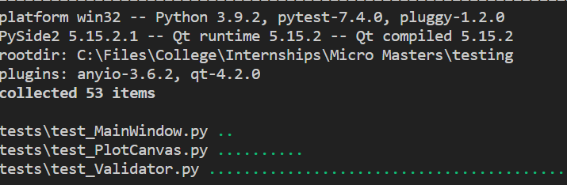

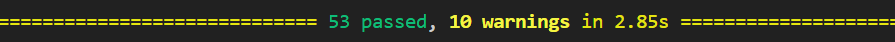

### Test Files
[test_MainWindow.py](./tests/test_MainWindow.py) contains the end to end tests for the application. The scenarios include correct usage of the application such as startup and checking for correctness of the UI and inputing correct data and checking for correctness of the plot. Another scenario includes inputing wrong data and checking for the correct error message.

[test_PlotCanvas.py](./tests/test_PlotCanvas.py) contains the unit tests for the plotter. The tests include checking for correctness of the plot for different functions and domain values.

[test_Validator.py](./tests/test_Validator.py) contains the unit tests for the validator. The tests include checking for correctness of the validator for different functions and domain values.

## Screenshots
Startup of the application with the default function and domain values
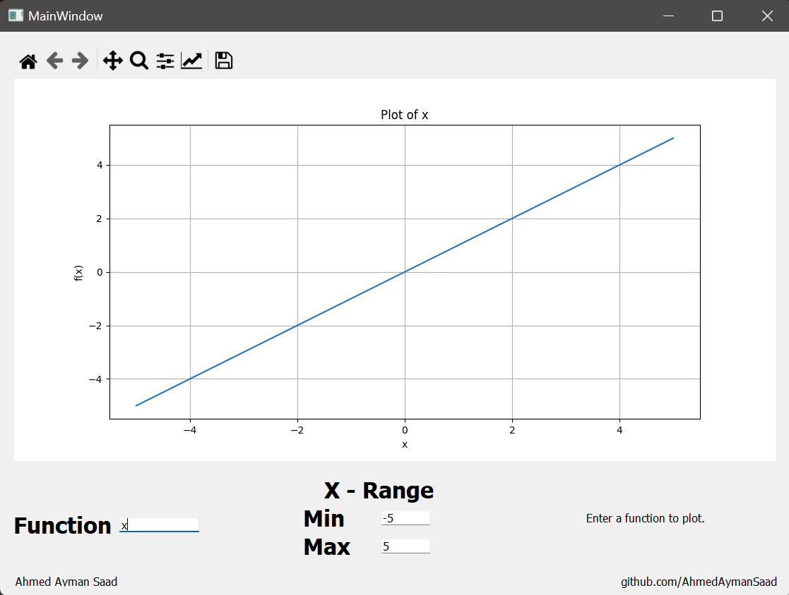

Plotting a function
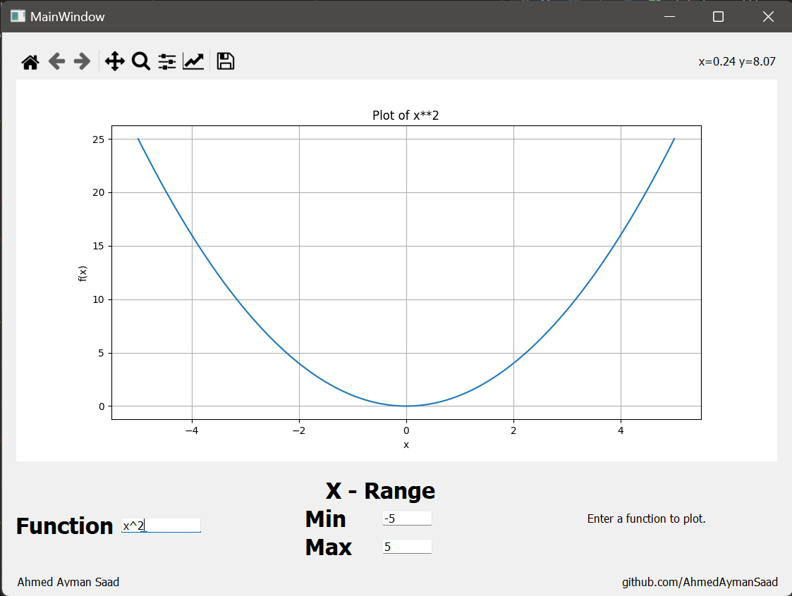

Changing the domain values
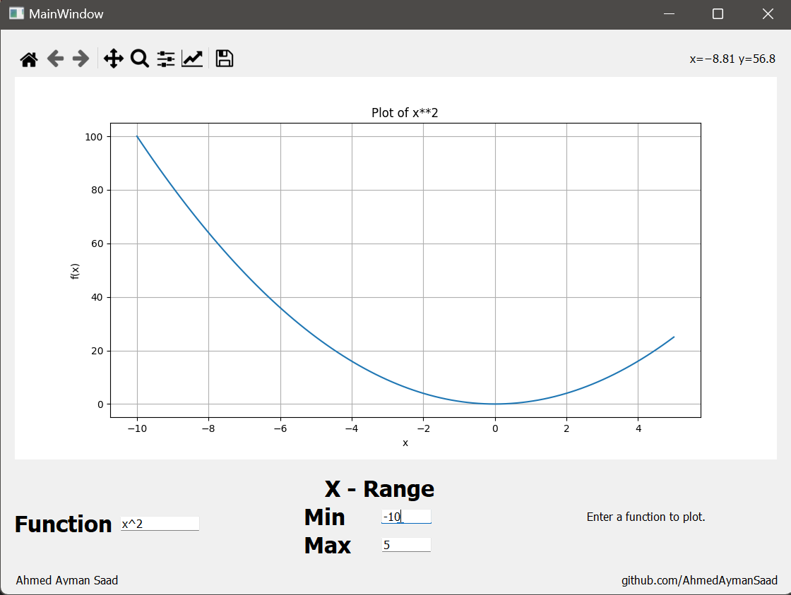

Plotting a function of a straight line
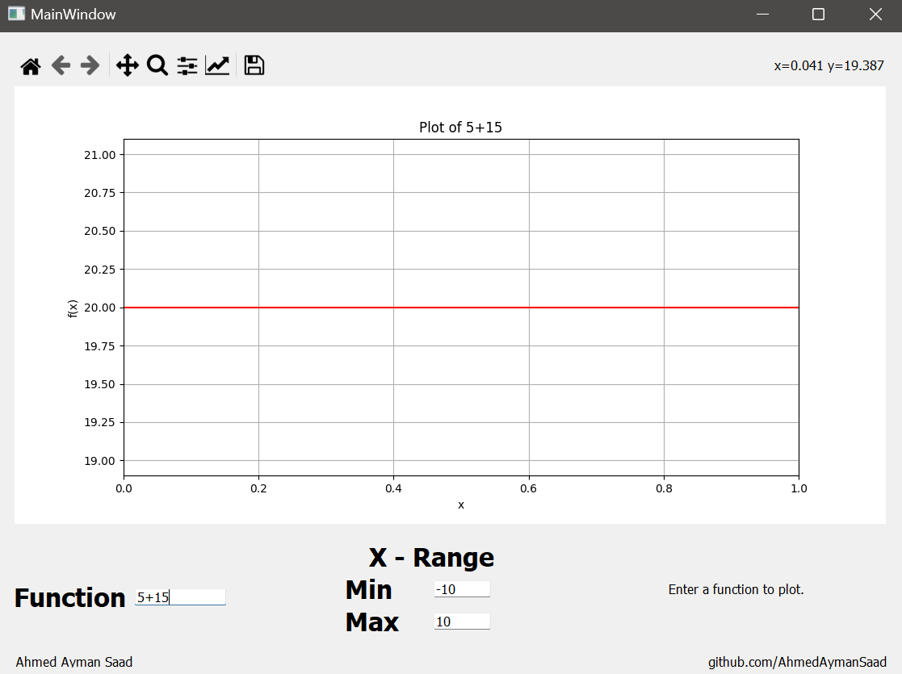

Another Plot
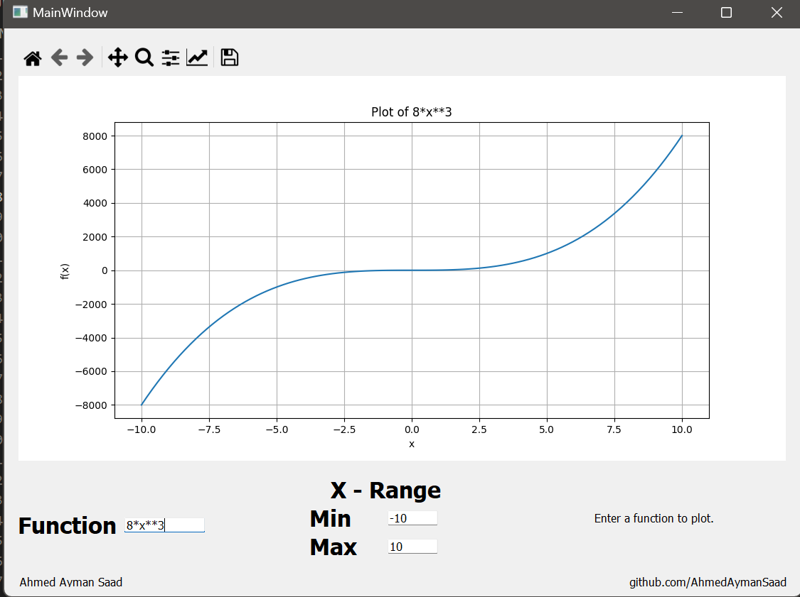

Error message for adding other variables in the function
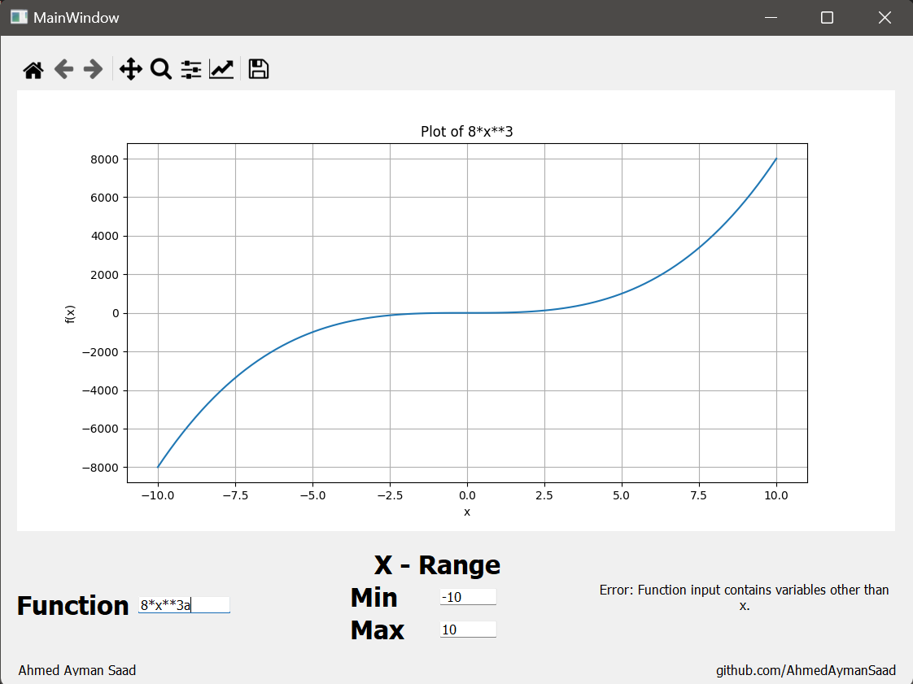

Error message for empty function
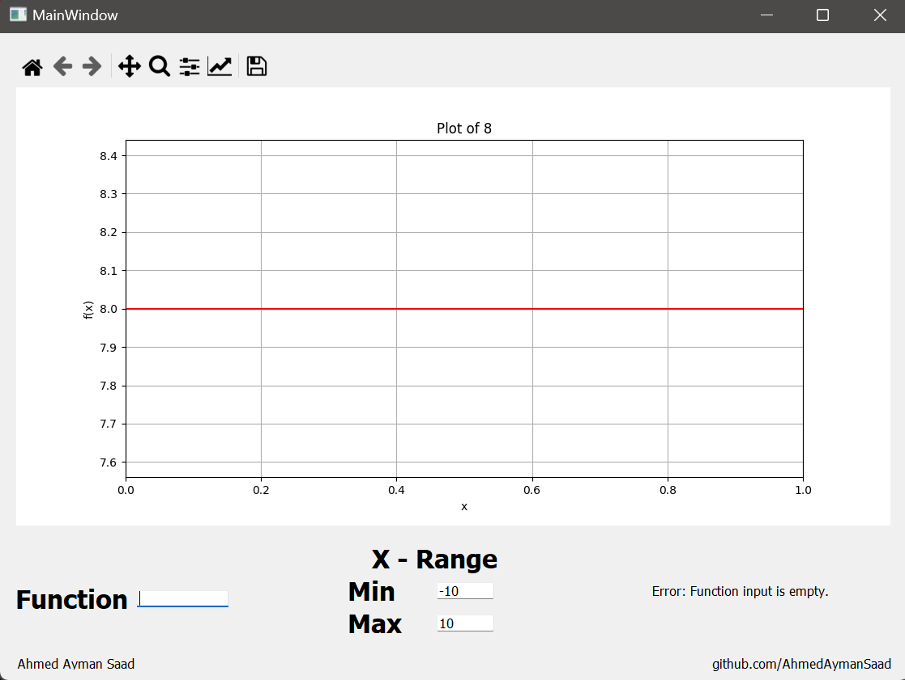

Error message for invalid characters in the function
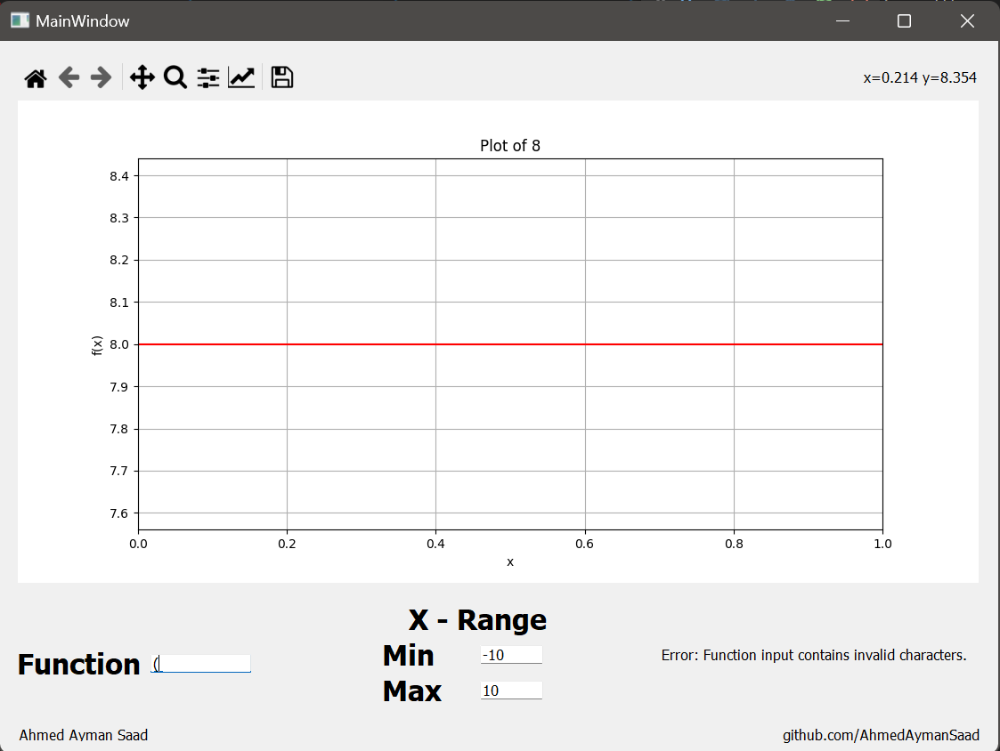

Error message for invalid domain values order
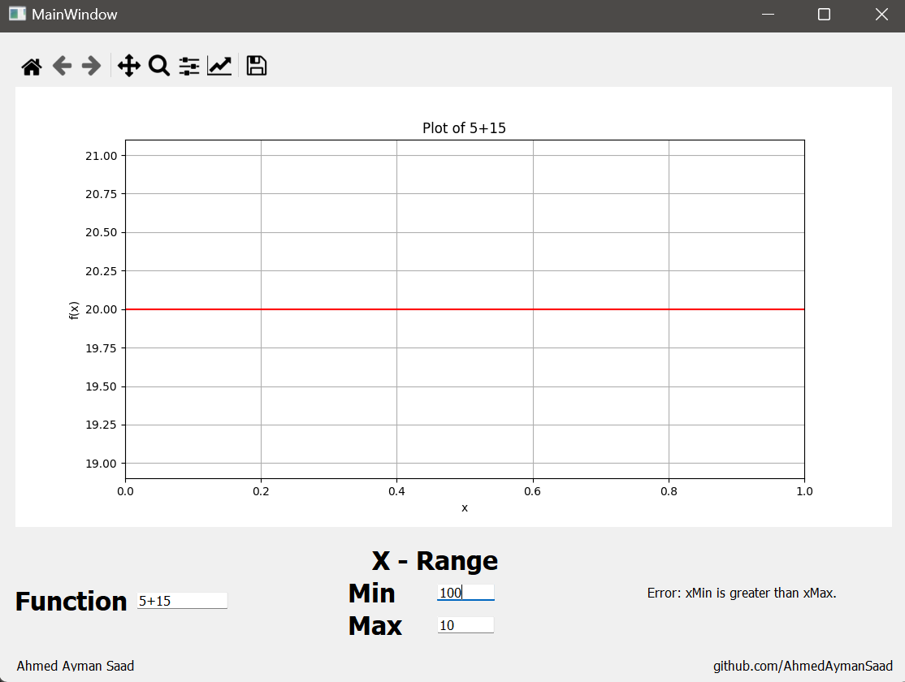

Error message for invalid domain values
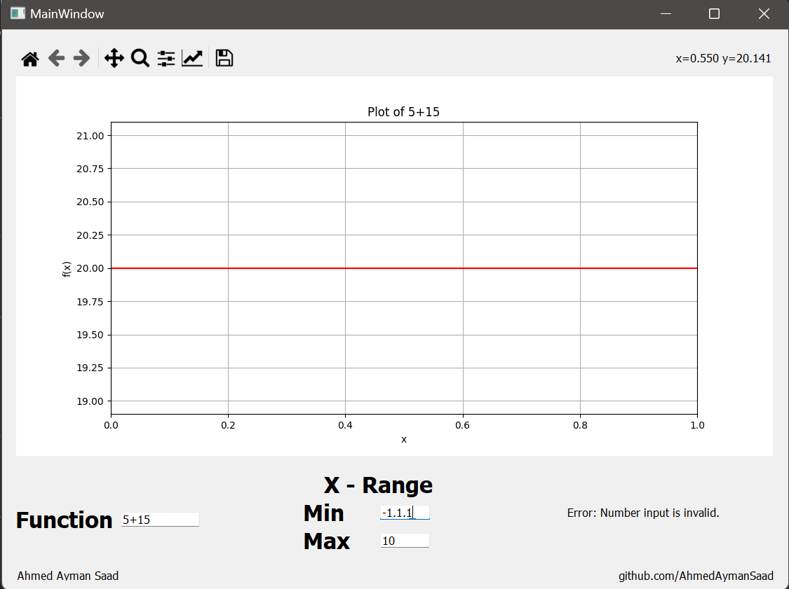